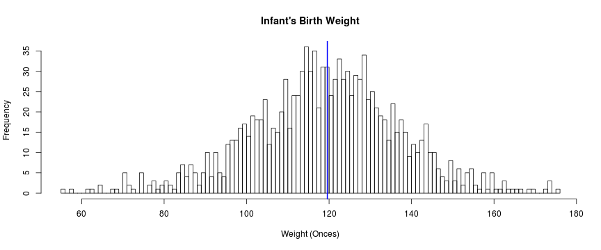

## Discover the impact of maternal age and smoking habits in baby weight

Smoking is a public health case, with impact in many areas, public spending, private spending, precocious retirement among other problems.

This application shows the impact of mother's smoking and age in the baby's weight at birth.

This app uses a "Babies" dataset from UsingR package. 

Source: http://cran.r-project.org/web/packages/UsingR/UsingR.pdf

--- .class #id 

## View a distribution

You can view a distribution of filtered data in a Histogram with a mean line.


```r
 library(UsingR);data(babies);
 hist(babies$wt,xlab="Weight (Onces)", 
             main="Infant's Birth Weight",breaks=100)
        abline(v = mean(babies$wt), col = "blue", lwd = 2)
```

 


--- .class #id 

## View a datatable

View and navigate the data with the date table feature: filter the results, sort, and go deeper into data.


--- .class #id 

## Combine filters

Combine filters to pursue an answer. 

Use right now: http://fabiocmazzo.shinyapps.io/dev_data_products_project

 


